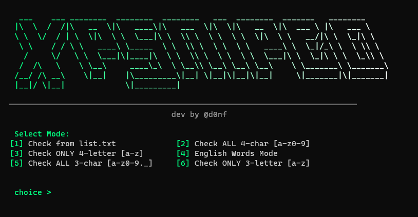

# XPSNIPED

XPSNIPED is a fast and efficient tool written in Go, designed to help you check for available Discord usernames. It works by streaming through combinations or wordlists and checking them against the Discord API using rotating proxies to avoid rate limits.



## How it works

The tool uses high concurrency (300 simultaneous workers by default) to perform checks rapidly. It supports several modes:
- **List mode**: Checks a custom list of usernames you provide in `list.txt`.
- **Combination modes**: Automatically generates and shuffles all possible 3 or 4 character usernames.
- **Dictionary mode**: Downloads and checks a massive list of English words.

When an available username is found, it is printed to the console, saved to `available.txt`, and sent to your Discord webhook if configured.

## Getting Started

To use XPSNIPED, you need a few things set up in the same folder as the executable:

1. **Proxies**: Create a `proxy.txt` file and paste your proxies inside (one per line). The tool supports the `user:pass@ip:port` or `ip:port` format.
2. **Configuration**: Edit the `config.json` file to set your preferences.

### config.json Example

```json
{
    "webhook_url": "https://discord.com/api/webhooks/...",
}
```

- `webhook_url`: (Optional) Your Discord webhook for notifications.

## Compilation

To build the tool from source, you must first download and install **Go (Golang)** from the official website (https://go.dev/). Once installed, run the following command in your terminal:


```bash
go build -o xpsniped.exe main.go
```

Simply launch the executable and choose a mode from the menu. The tool will handle the rest, including downloading the wordlist if needed and managing proxy rotation.

**Note on Speed**: If the tool feels slow, it is almost certainly due to the quality of your proxies. High-quality proxies are required for maximum performance.

## Developer

Developed by **@pachii**. For updates or support, contact me on Discord in bio.


---

*Note: This tool is intended for research and educational purposes. Always respect the platform's terms of service.*
*Dev Note : I'm just a small developer, don't attack me if there are errors and bugs pls (PS: I'm not English, I tried to translate the tool but I don't think it's quite right)*
